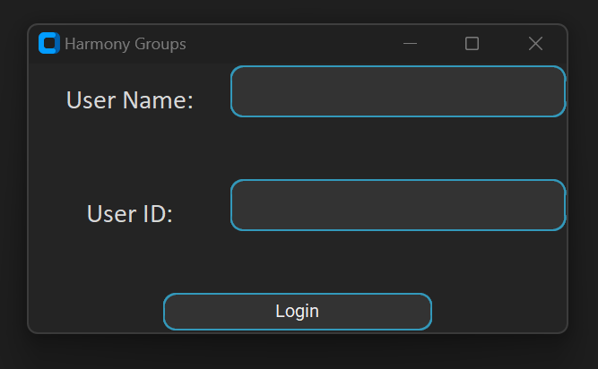
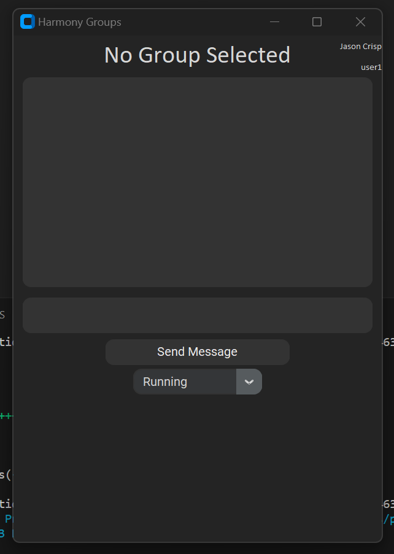
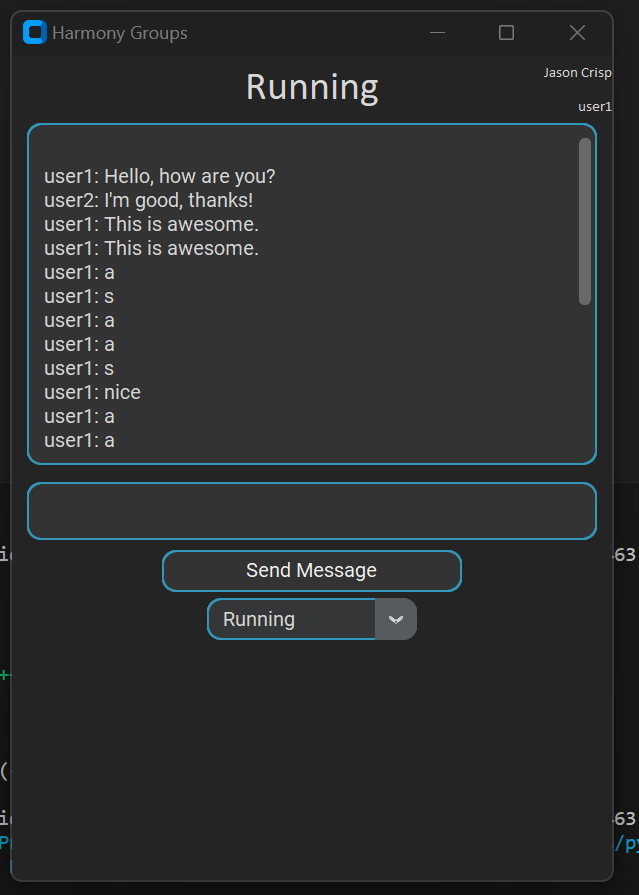

# Harmony_Groups
An application that has common activites that make people happy. These activites are held in groups within the application and depending on the user that has signed in, they are allowed into the activites they belong to. These activites function as group chat for people that have similiar interest with these activites. The application uses a hash table to admit users into the specific group by verifying they belong to that activity. This application also uses [Customtkinter](https://customtkinter.tomschimansky.com/) for the GUI layout.

## Project Goals
This application should accomplish the following objectives:
  - Effectively use a hash table to allow users into the groups they belong to.
  - Have a proper GUI that user friendly and fits the application.
  - Demonstrate proper team collaboration.
  - Highlight proper coding techniques and algorithms we have learned throughout the semester. The algorithm focused mainly within this application is a hash table.
  - Provide a unique user experience which should promote happiness to the user as well as make the user feel as if they are safe.

## Significance of the Project
This project has some interesting takes on normal group chats. First the user should feel safe, after they are logged in, to join their respective groups. This is because each user ID is checked before they join the desired group to ensure that the user belongs to that group. This is done through a hash table and hash function. Once again, it is important to mention that the user must be logged in, which is done through the inital login page the user is preseneted with upon launching the application. From here the user is then entered into the group and able to see the previous messages from however long ago from themselves and other users. There is also chances for inspirational quotes to display when the user sends messages. This is to make the user feel happy within this safe space. It is important to note that the database for this application is a .txt file within the located within the repository. This is to simulate an actual database. This file is updated throughout the use of the application as messages are input.

## Installation and Usage Instructions
### Launching the Application
It is preferred to launch this application from a venv since there are a few required packages.
- Begin by grabbing the code base from this repository.
- Navigate into the Harmony_Groups directory.
- Creating the venv
  - Windows: In the terminal type __python -m venv venv__
  - macOS / Linux: In the terminal type __python3 -m venv venv__
- Launching the venv
  - Windows: In the terminal type __.\venv\Scripts\activate__
  - macOS / Linux: In the terminal type source venv/bin/activate
- Download the necessary packages by typing __pip install .__ into the terminal.
- The application can then be launched from the top level directory by typing __python .\src\HarmonyGroup.py__ into the terminal.
- Be sure to deactivate the venv by typing __deactivate__ into the terminal once finished.
### User Manual
- Login screen
  - Start by typing in the correct user information into the login page. If entered incorrectly a prompt will pop up stating that and you will be asked to try again.
  - 
- Main application
  - Upon successful login the user is greeted with a default layout for the application. The user must first choose a group from the combobox near the bottom of the screen.
  - 
  - Once a group is selected, and the user is a member of that group, the user will then be switched to that group. This is noted by the change of border colors within the application.
  - 
  - The user can now begin seeing and typing messages to the other users within that group.
  
## Code Structure

## List of Functionalities and Test Results

## Discussion and Conclusion
