# Harmony_Groups
An application that has common activites that make people happy. These activites are held in groups within the application and depending on the user that has signed in, they are allowed into the activites they belong to. These activites function as group chat for people that have similiar interest with these activites. The application uses a hash table to admit users into the specific group by verifying they belong to that activity. This application also uses [Customtkinter](https://customtkinter.tomschimansky.com/) for the GUI layout.

## Project Goals
This application should accomplish the following objectives:
  - Effectively use a hash table to allow users into the groups they belong to.
  - Have a proper GUI that user friendly and fits the application.
  - Demonstrate proper team collaboration.
  - Highlight proper coding techniques and algorithms we have learned throughout the semester. The algorithm focused mainly within this application is a hash table.
  - Provide a unique user experience which should promote happiness to the user as well as make the user feel as if they are safe.

## Significance of the Project
This project has some interesting takes on normal group chats. First the user should feel safe, after they are logged in, to join their respective groups. This is because each user ID is checked before they join the desired group to ensure that the user belongs to that group. This is done through a hash table and hash function. Once again, it is important to mention that the user must be logged in, which is done through the inital login page the user is preseneted with upon launching the application. From here the user is then entered into the group and able to see the previous messages from however long ago from themselves and other users. There is also chances for inspirational quotes to display when the user sends messages. This is to make the user feel happy within this safe space. It is important to note that the database for this application is a .txt file within the located within the repository. This is to simulate an actual database. This file is updated throughout the use of the application as messages are input.

## Installation and Usage Instructions
### Launching the Application
It is preferred to launch this application from a venv since there are a few required packages.
- Begin by grabbing the code base from this repository.
- Navigate into the Harmony_Groups directory.
- Creating the venv
  - Windows: In the terminal type __python -m venv venv__
  - macOS / Linux: In the terminal type __python3 -m venv venv__
- Launching the venv
  - Windows: In the terminal type __.\venv\Scripts\activate__
  - macOS / Linux: In the terminal type source venv/bin/activate
- Download the necessary packages by typing __pip install .__ into the terminal.
- The application can then be launched from the top level directory by typing __python .\src\HarmonyGroup.py__ into the terminal.
- Be sure to deactivate the venv by typing __deactivate__ into the terminal once finished.
### User Manual
- Login screen
  - Start by typing in the correct user information into the login page. If entered incorrectly a prompt will pop up stating that and you will be asked to try again.
  - All of the user information can be found in src/Database.txt, and each user is supplied a userID and a username. To check to see if a user is in a certain group you can either switch each gruop when logged in to check or check within Database.txt and see if their userID is a participant in that respective group. The first user can enter all groups, which is good for testing. 
  - 
- Main application
  - Upon successful login the user is greeted with a default layout for the application. The user must first choose a group from the combobox near the bottom of the screen.
  - 
  - Once a group is selected, and the user is a member of that group, the user will then be switched to that group. This is noted by the change of border colors within the application.
  - If the user is not apart of the group they switched to, a message will pop up indicating that. 
  - 
  - The user can now begin seeing and typing messages to the other users within that group.
  - Experiment and play around with the application, upon sending messages, the database updates.
  - Type a lot of messages to see if a quote pops up. There is a 20% chance for a quote to pop up when sending a message.
  
## Code Structure
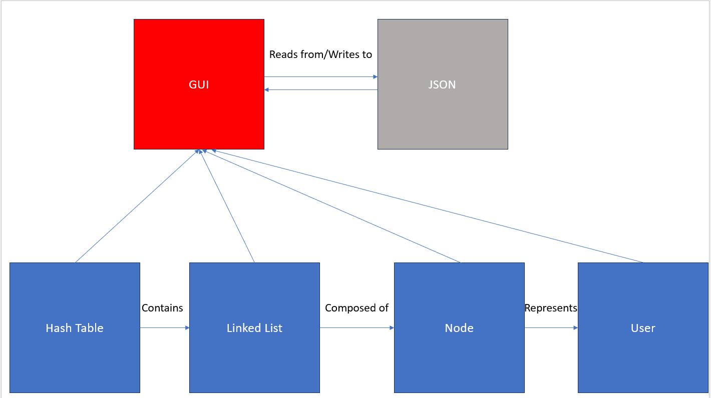

Our project structure is fairly straightforward; we use a list data structure to create a HashTable class that represents different activities people enjoy, and each HashTable object has LinkedList objects as elements. These LinkedList objects are composed of Node objects, and the Node objects represent User objects that have joined an activity's group chat. User objects represent a user of our application, and User objects have a name and ID as attributes for easy identification.  

On top of all this is our Graphical User Interface (GUI) that the user interacts with. Initially, the user logs in with their name and user ID through a Login GUI window. From there, the main GUI window appears that has the group chat message board, a textbox for entering a message, a 'Send Message' button to send a message, and then a drop-down box to select the different group chats the user wants to explore. Any and all data entered and retrieved from the app is done with the help of the Database.txt file formatted in JSON.  

To summarize, underneath the covers we have a HashTable class to represent different activities such as Running, Swimming, Surfing, etc., and these HashTable objects contain LinkedList objects at each index in the HashTable. The LinkedList objects can contain Node objects, and these Node objects store User objects which represent users who are part of a specific activity's group chat. On top of this are the Login and Main GUI windows, and the GUI consistently communicates with the Database.txt JSON file to send and retrieve information.  

## List of Functionalities and Test Results
Our app's functionalities:
- Login window
  - Logs in to the app after verifying the user's credentials
  - Otherwise presents the user with a message box informing the user the credentials they entered were invalid
- Main window
  - Shows the user their name and ID in the top-right corner
  - Shows the current activity's group chat the user is viewing e.g. 'Running' appears at the top when viewing the Running activity's group chat
  - Displays the chat messages sent by individuals from a specific activity's group chat
  - Includes a textbox for users to enter a new message
  - Has a 'Send Message' button to allow users to send their message to the group chat
  - Includes a drop-down box that allows users to view and select a different activity's group chat
  - If the user selects a group chat they are not currently a member of, a message box will appear informing them they are not a participant of that group.
- Database
  - Stores and retrieves information such as valid users and their ID's, the different activities listed, and the messages the users have sent all in JSON format
 
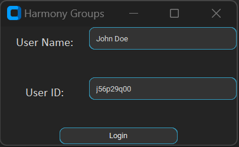
Example of an invalid user trying to login

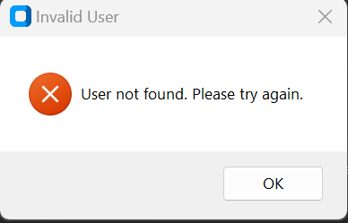
Window that pops up when invalid user tries to login  

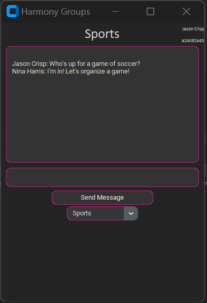
Example of a user viewing a group chat they are a participant of  

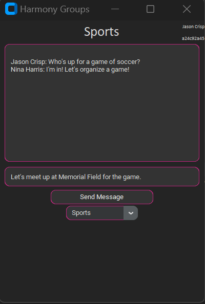
Example of a user entering a message to a group chat  

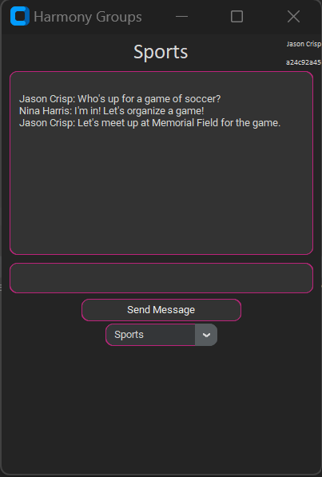
After pressing the 'Send Message' button, the message appears in the group chat  

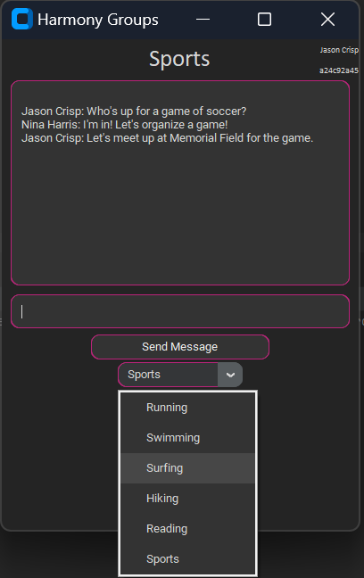
Example of all the other activities that have group chats the user can select  

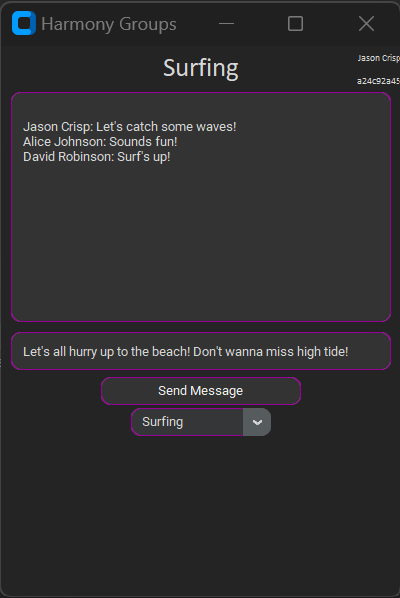
Example of a user viewing a different group chat they are a part of  

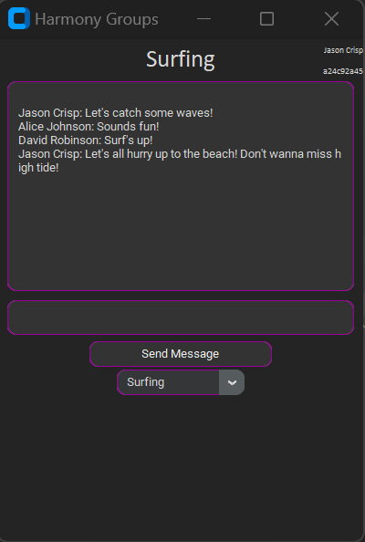
Since the user is also part of this group chat, they can enter a message here and have it display for everyone else to see  

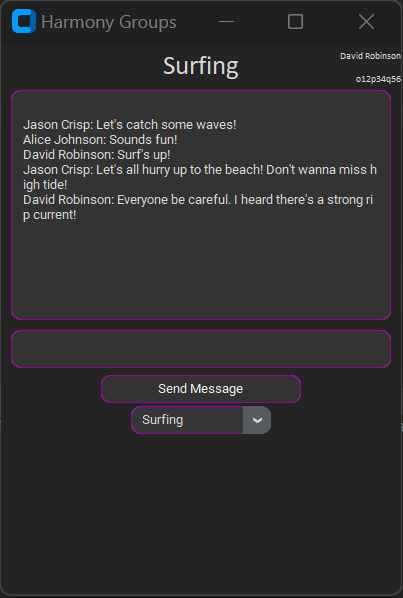
Example of a different user viewing and posting in a group chat they are a member of  

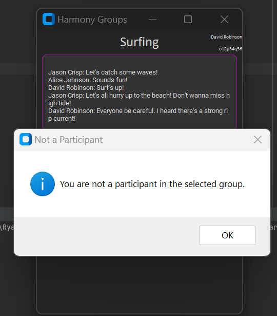
Example of a user trying to access a group chat they are not a member of  

## Discussion and Conclusion
During the development of the application, we ran into some issues, which include:
- ensuring the nodes inserted into the linked list were done in proper order
- updating a Node object's next and previous values when inserting/deleting into/from the Linked List
- deleting the proper node and re-adjusting the linked list
- transitioning from the Login window to the Main window after a user logged in  

Some current issues within the project include:
- when a user enters a long message into the group chat message box, a word may be improperly wrapped
- there is no way to log out and then log in as a different user without restarting the application

As of right now, our project is geared to be used by a small audience. It is not set up to be used by hundreds or thousands of users, or storing hundreds or thousands of messages as that would require lots of resources. Additionally, the application is not currently set up to be used by more than one user as it is more of a simulation of an actual group chat application such as Discord, and, as mentioned previously, there are some minor issues with text wrapping.  

In terms of application of course learning, we utilized many topics we learned in class. For example, to represent different activities such as Running, Swimming, Surfing, etc. we used a HashTable class that contains a function to uniquely hash a User object's ID, a function to calculate the index in the table (which is a list data structure) the User should be placed into, and the hash table also stores LinkedList objects to handle any collisions from hashing. A Node class with attributes for data value, a pointer to the next Node, and another pointer to the previous Node was created to store User objects within a LinkedList object. And all classes follow an object-oriented approach to create unique instances to represent different objects. For example, the User class is defined an object-oriented manner so multiple User objects can be created to represent different users with different names and ID's. Moreover, all classes are documented using a consistent format to make for easy understanding of the code.  
